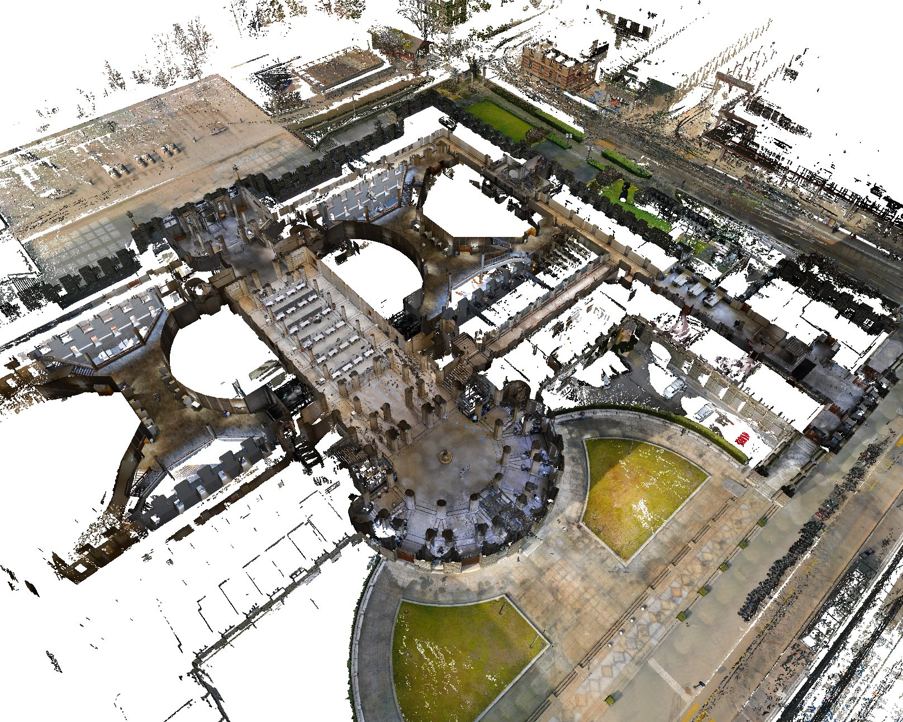
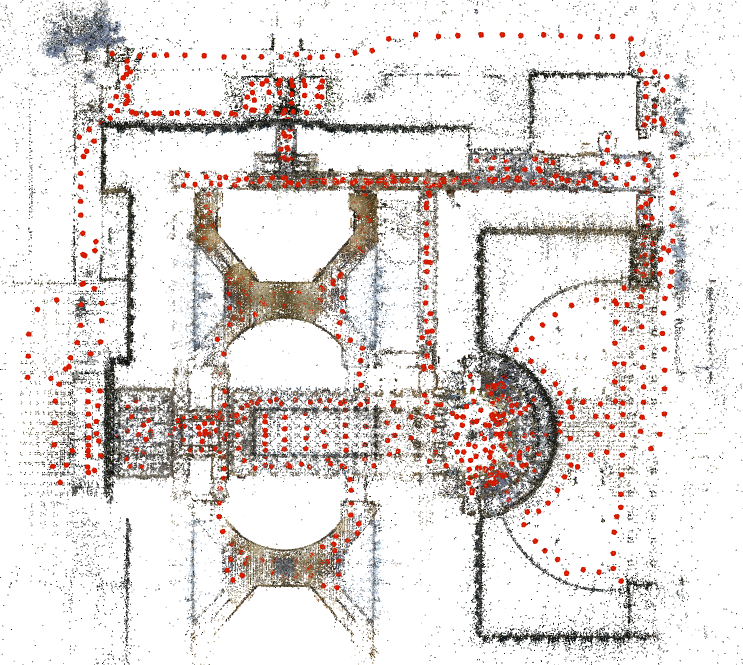
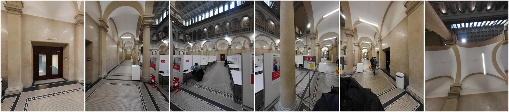
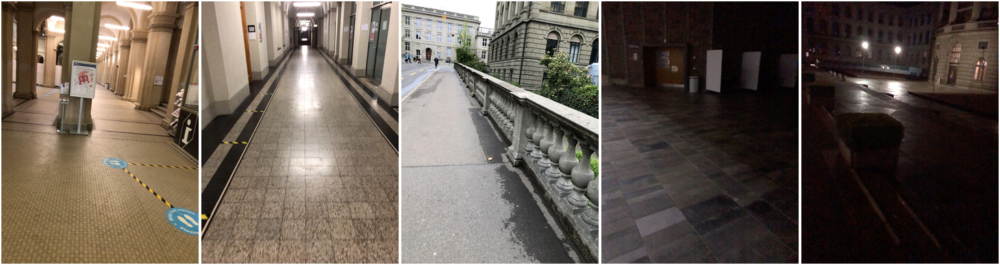
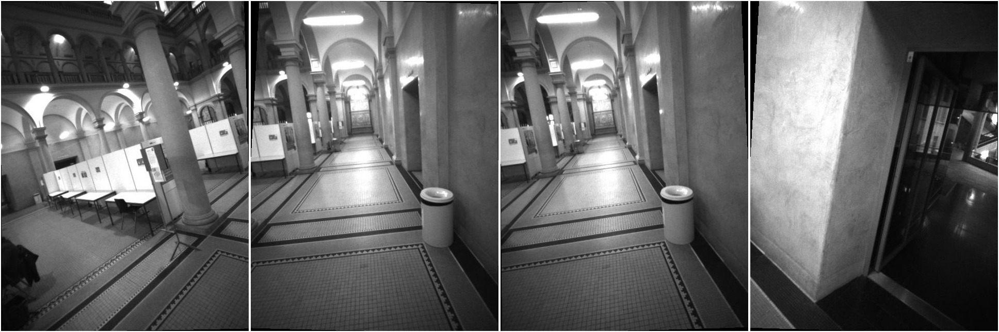
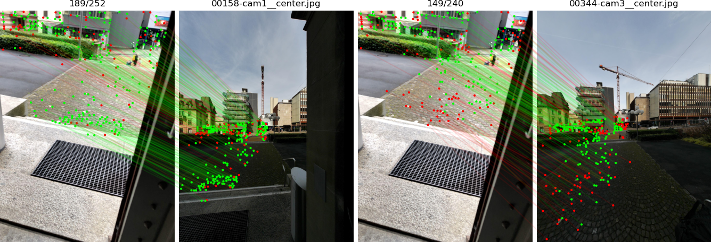

# ETH-MS localization dataset


The [Computer Vision & Geometry Group at ETH Zurich](http://www.cvg.ethz.ch/) and the [Microsoft Mixed Reality & AI Lab Zurich](https://www.microsoft.com/en-us/research/lab/mixed-reality-ai-zurich/) introduce a new dataset for visual localization with a focus on Augmented Reality scenarios. The data covers day & night illumination changes, large indoor & outdoor environments, and different sensor configurations for handheld and head-mounted devices.

This is a preview of a much larger dataset which will be released later. This preview is part of the challenge of the [ICCV 2021 workshop on Long-Term Visual Localization under Changing Conditions](https://sites.google.com/view/ltvl2021/).

<p align="center">
    
  <br /><em>Left: dense 3D model of the capture area. Right: sparse 3D map and poses of the mapping images.</em>
</p>

## Data

We provide images captured at the HG building of the ETH Zurich campus, both in the main halls and on the sidewalk. This environments is challenging as it exhibits many self-similarities and symmetric structures. The images are split into mapping and query images. The **mapping** images were captured by the 6-camera rig of a NavVis M6 mobile scanner. The **query** images are extracted from sequences recorded months apart by:

- an **iPhone 8 as single images** from the back camera,
- a **HoloLens2 as sets of 4 images** from the rig of 4 tracking cameras.

| Type                  | Sensor                          | Resolution | # images | Date                                      |
| --------------------- | ------------------------------- | ---------- | -------- | ----------------------------------------- |
| Mapping               | NavVis M6, RGB cameras          | 1442x1920  | 6 x 819  | 2021-02-18 (morning)                      |
| Queries: single-image | iPhone 8 ARKit, RGB back camera | 1440x1920  | 300      | 2021-04-29 (day) <br />2021-05-04 (night) |
| Queries: rigs         | HoloLens2, grayscale cameras    | 480x640    | 4 x 300  | 2021-02-18 (morning)                      |

<p align="center">
  
  <br /><em>6 images captured by the NavVis M6 camera rig</em>
</p>

<p align="center">
  
  <br /><em>phone images, indoor/outdoor and day/night</em>
</p>

<p align="center">
  
  <br /><em>4 images captured by the HoloLens2 camera rig</em>
</p>

We provide the poses of the mapping images but hold private those of the query images. We however provide intrinsic camera calibrations for all images and relative rig poses of the HoloLens2. We have obfuscated the temporal order of the images to prevent challenge participants from relying on image sequences.

The data is available at the following location in the [Kapture](https://github.com/naver/kapture) format: https://cvg-data.inf.ethz.ch/eth_ms_dataset/iccv2021 The timestamps and camera (or rig) IDs of the single (and rig) queries are listed in the files `queries_single.txt` and `queries_rigs.txt`.

## ICCV 2021 Challenge

The goal of the challenge is to estimate the poses of the single query images (iPhone) and of the camera rigs (HoloLens2) listed in the files `queries_[single|rigs].txt`. Challenge participants are expected to submit a single text file to the evaluation server at [visuallocalization.net](https://www.visuallocalization.net/). Each line of this file corresponds to the pose of one single image or rig in the format:
```
timestamp/camera_or_rig_id qw qx qy qz tx ty tz
```

The pose is expressed as quaternion `qw qx qy qz` and camera translation `tx ty tz` in the COLMAP coordinate system, i.e. **from the world to camera frame**. Here is an example of two poses from the submission file generated by the demo script below:

```
0/cam_phone_0_2 -0.08691328955558617 -0.19368004528425714 0.834072988867356 -0.5091722394231546 16.350978764689117 33.55611563888155 -57.70510693949592
1/hetrig_1 0.0005166642265923816 0.8648426950562507 0.0027338466179127005 -0.5020352297882964 -31.154051098151406 9.907290815759488 58.16937396700082
```
The submission file should be composed of a total of 600 queries.

## Localization demo

We provide a baseline method with [hloc](https://github.com/cvg/Hierarchical-Localization) using SuperPoint+SuperGlue for image matching and NetVLAD for image retrieval. The pipeline estimates absolute poses of the queries using P3P for the single images and a generalized solver GP3P for the camera rigs.

Reauirements:
- Python >= 3.6
- latest commits of [COLMAP](https://colmap.github.io/) and [pycolmap](https://github.com/mihaidusmanu/pycolmap)
- [hloc](https://github.com/cvg/Hierarchical-Localization) and its dependencies
- [kapture](https://github.com/naver/kapture): `pip install kapture`

To download the data and run the demo pipeline:
```
wget https://cvg-data.inf.ethz.ch/eth_ms_dataset/iccv2021/data.zip && unzip data.zip
python3 -m demo.pipeline
```

This will create a submission file in `outputs/netvlad+superpoint+superglue/results.txt` as well as visualizations in `outputs/netvlad+superpoint+superglue/viz/`:

<p align="center">
  
</p>


Once submitted to the benchmark, this should roughly give the following recall:
| Method                       | Single-image queries | Rig queries        |
| ---------------------------- | -------------------- | ------------------ |
| NetVLAD+SuperPoint+SuperGlue | 41.0 / 51.7 / 57.7   | 70.0 / 74.3 / 75.0 |

for (orientation, distance) thresholds (1°, 10cm) / (2°, 25cm) / (5°, 1m).


## Citation

Please cite the dataset as below if you use this preview data in an academic publication:
```bibtex
@misc{eth_ms_visloc_2021,
	title        = {{The ETH-Microsoft Localization Dataset}},
	author       = {{ETH Zurich Computer Vision Group and Microsoft Mixed Reality \& AI Lab Zurich}},
	howpublished = {\url{https://github.com/cvg/visloc-iccv2021}},
	year         = 2021,
}
```

## Privacy

We did our best to anonymize the data by blurring all faces and license plates visible in the images. Please let us know if you find any issue or are not satisfied with the level of anonymization. You can reach out to Paul-Edouard at `psarlin at ethz dot ch`

## License

The data and code are provided under the Creative Commons license [Attribution-NonCommercial-ShareAlike 4.0 International (CC BY-NC-SA 4.0)](https://creativecommons.org/licenses/by-nc-sa/4.0/). This means that you must give appropriate credit, provide a link to the license, and indicate if changes were made. You may do so in any reasonable manner, but not in any way that suggests the licensor endorses you or your use. You may not use the material for commercial purposes and if you remix, transform, or build upon the material, you must distribute your contributions under the same license as the original.  **Note that this license does not cover external modules that are available only under restrictive licenses, such as SuperPoint and SuperGlue.**
